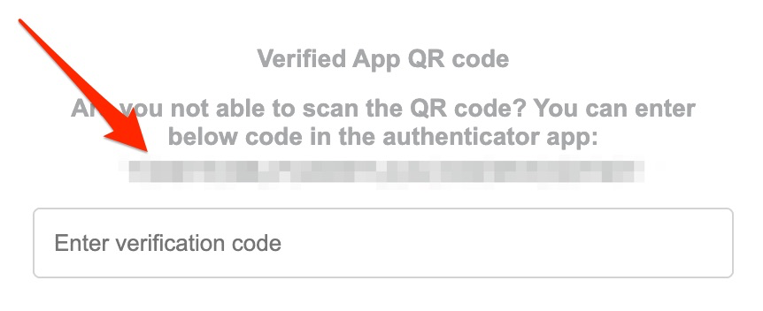

# ExactOnline CLI (and Go library)

_ExactOnline is the COBOL of Dutch cloud accounting - nobody loves it, everybody uses it, and it'll outlive us all_

CLI tool for Exact Online (NL) to automate common bookkeeping tasks while keeping your sanity.

## Install

Requires [Go](https://go.dev/dl/).

```
go install github.com/gwillem/exactonline-go/cmd/exact@latest
```

## Usage

### Login

Authenticate (once) with your Exact Online account. You'll be prompted for your email, password, and TOTP secret.

```
exact login
```

The TOTP secret is the token shown when you set up two-factor authentication (or click "reset 2fa for this account").



Credentials and session cookies are stored in `$XDG_CACHE_HOME/exact-online/` (defaults to `~/.cache/exact-online/`). The session is reused automatically, so you should only need to run login once.

### Upload purchase invoices

```
exact inkoop upload invoice1.pdf invoice2.pdf
```

Accepted file types: PDF, TIF, TIFF, JPG, JPEG. Files are uploaded in batches of 15.

### List open purchase invoices

```
exact inkoop list
```

Lists all purchase invoices that haven't been booked yet.

## Flags

| Flag              | Description                      |
| ----------------- | -------------------------------- |
| `-v`, `--verbose` | Enable verbose logging to stderr |

# Roadmap

- Sales invoices?
- P&L?
- ...?

Pull Requests welcome!

NB this CLI uses the web interface of ExactOnline. They do have an API but for some reason its not available to paying customers 🤡

Using the web interface shouldn't be much of a problem, since it hasn't changed since 2004. It's probably stable.
